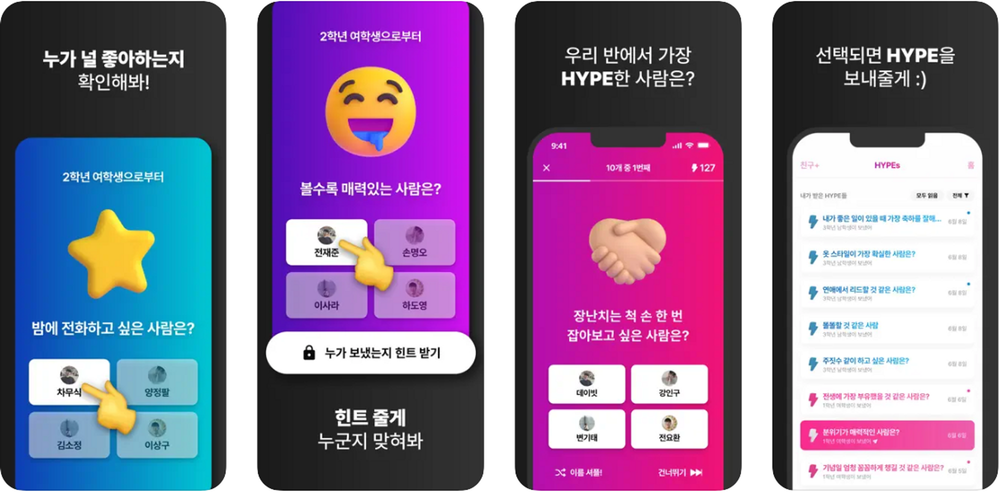

# 포트폴리오

# 💼 경력

### 프리랜서 | 2025년 12월 - 현재

- DecoMyTree 서버 유지 보수 : DDos 공격 대응, Rds & Redis Vertical Upgrade, 광고 이익 증가를 위한 API 추가 개발
- Uphill 풀스택 개발 외주 : 학생 문제 풀이 앱  개발, React Native Brdige를 통해 애플 펜슬 풀이 기능 구현.

### (주) 언박서즈 - 서버 개발자 | 2022년 9월 - 2024년 9월

- 10개 이상의 다양한 종류 서비스의 API 서버와 인프라를 구축

# 🎓 학력

### 건축공학 학사 - 연세대학교 | 2024년 2월 졸업

- 수상 경험
    - [2021년 구조물 내진 설계 대회] : 국토교통부장관상
    - [2022년 LH 대학(원)생 부동산 금융 논문 공모전] : 우수상

# 🚀 대표 프로젝트

### ‘이등급 사관학원’ 수학 교습 프로그램

- Info
    - 강의 영상과 문제들로 이루어진 수학 교습 프로그램, 풀스택 개발.
    - 학생 실력에 따른 문제 선별 알고리즘 적용.
- 개발 스택: django, aws cloud (rds, redis, ec2)

### ‘HYPE’ - 익명 투표 sns

- Info
    - 60만명 이상의 학생이 사용한 앱의 API 서버 제작 및 유지 보수.
    - rds aurora & ec2 Autoscaling과 redis cache 적용
    - Percona 을 활용한 Mysql의 대용량 테이블 migrations시 Online DDL 적용.
- 개발 스택 & 툴: django-rest-framework, aws cloud (rds, redis, ec2), Mysql, Datadog
    
    
    

### ‘Concept’ - AI 프로필

- Info
    - 10만명 이상의 사용자가 사용한 앱의 API 서버 제작 및 유지 보수
    - AI 서버와 클라이언트 앱 사이에서 안정적인 데이터 전달 시스템 구축
    - Terraform을 사용한 인프라 관리
- 개발 스택 & 툴 : fastapi, aws cloud (rds, redis, ecs, sqs), Postgres, Terraform
- 링크 : https://apps.apple.com/kr/app/concept-ai-%ED%94%84%EB%A1%9C%ED%95%84-%EC%8A%A4%EB%83%85%EC%82%AC%EC%A7%84/id6470380557

### ‘Deco My Tree’ - 익명 쪽지 서비스

- Info
    - 600만명 이상의 사용자가 사용한 앱의 API 서버 제작 및 유지 보수
    - Public API로 DB Write가 이루어졌기 때문에, FakeToken과 aws waf를 활용해 DDos 대응
- 개발 스택 & 툴 : Fiber(golang), aws cloud (rds, redis, ec2, waf), Postgres
- 링크 : https://decomytree.com/, https://apps.apple.com/us/app/deco-my-tree-x-mas-messages/id6473818952

### '업힐' - 학생 문제 풀이 앱

- Info
    - 학생들이 문제를 풀고 풀이에 따른 피드백을 받는 앱
    - React Native Brdige를 통해 애플 펜슬 풀이 기능 구현
    - 선생이 사용하는 관리자 페이지는 react로 제작
- 개발 스택 & 툴 : django, react native, react, aws cloud (rds, redis, ec2)
- 링크 : https://apps.apple.com/kr/app/%EC%97%85%ED%9E%90/id6756876879

# 🔨 개발 스택

- django&fastapi (python)
- fiber (golang)
- aws cloud
- react & react native

# 📬 연락처

- 이메일: sdhkygg@gmail.com